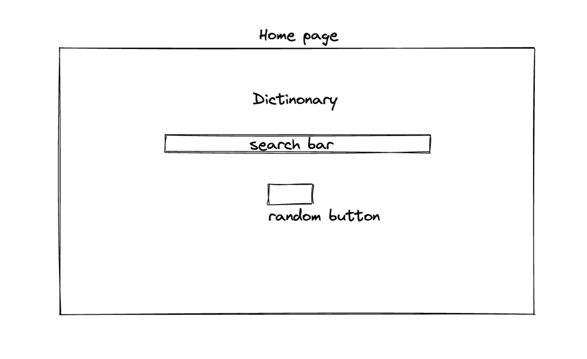
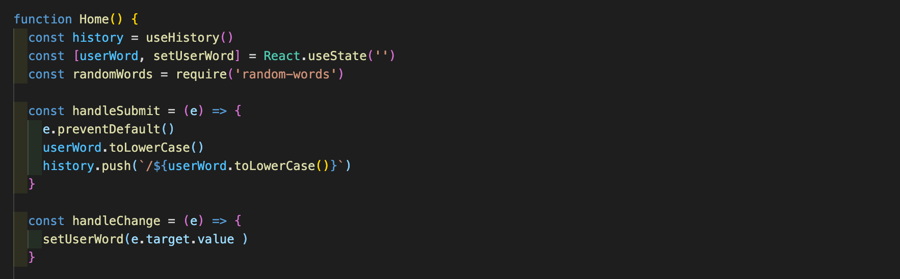

# Overview

### Team Members
[Esin Yilmazbilek](https://github.com/EsinYilmazbilek)
[Michael von Etzdorf](https://github.com/mikeomerta)

For the second project of the course, we were put in pairs to build a React application that consumes a public API. Upon deciding to build an online English dictionary, we researched and found an API that is practical to use, functions in the desired way and free of charge. We used the CSS framework Bulma for the first time to make styling the website easier and faster.

# Brief:
1. The project should consume a public API.
2. The project should have several components.

# Deployment
The app has been deployed with Netlify and is available [here](https://clever-nightingale.netlify.app/).

# Timeframe
2 days

# Goal
* To build an online English Dictionary.
* To include a randomiser button.

# Technologies Used
* Bulma
* CSS
* React
* Axios
* Express
* Node.js
* GitHub

# Process
### Planning:

Working via Zoom, the first step was to decide what we want to build as a team. After going through ideas and deciding on building a dictionary, we searched for a suitable API. Out of a dozen options we found, only a handful were functional and out of those only one for free of charge. Once the API was ready, we moved onto creating wireframes to design and plan every component of the project. 

### Build:

On both days, we did morning stand-ups to share our progress from the evening before and plan ahead. We kept Zoom on during the day which kept us in constant communication. We worked on separate sections simultaneously to save time and shared snippets of code with each other via Slack. 

1. The website consists of a home page, which is also the index page, with a search bar and a separate page where it shows the definition of the searched word.

2. We wanted the search bar to recognise the words regardless of the capitalisation, therefore my teammate Michael built the code that allows it and shows the definition accordingly.

3. In the meantime, I worked on getting the right data to show up on the Definition Card component from the API which had a complex structure of objects and arrays with multiple definitions. Michael added the audio player component on this page and hid the audio player if there wasn’t any audio available on the API.

4. On the Definition Show component I mapped through the objects and retrieved the data we needed.

5. The definition show page has a simple layout where it displays different meanings on separate cards based on the parts of speech if applicable. It provides multiple definitions, origins, audio and phonetics where available.

6. We kept the search bar appearing on both Home and Definition Show pages so the user can search another word right away.

7. We wanted to include an extra feature and add a button that chooses a random word and displays its definition. Michael worked on this feature and added the button on the homepage.

8. The error handling was done via react notify toast where we added an error message for when a spelling mistake was made. 

9. The styling was made using Bulma. It was the first time me and my team mate used this framework and we found it simple to work with. I used bulma components as I built the sections on the home and definition show pages which helped me visualise the final result from the beginning. 

# Challenges
* Having to find a suitable API was the biggest challenge of the project. 
* Once we found it, its structure was more complex than anything else we worked with before, made of a nested data structure containing objects and arrays.
* Creating a random word button was a challenge and this function currently has certain bugs.

# Wins
* Being my first pair coding project, it showed me the benefits of working together with someone else. It was a very positive experience to be able to have discussions with the person I was working with, hearing their ideas and solutions while learning together. It helped me to plan and move forward with a more precise manner and gave us a wider perspective on how to approach the tasks.
* Using Bulma helped us save time on the design and learn about a new CSS framework.

# Future improvements
1. There are  a few features I would like to add going forward:
2. I would like to add further error handling for the cases where the API doesn’t retrieve the data on the first instance or doesn’t have the searched word in its contents, and displays a blank page. This is especially an issue with the random word functionality if the word doesn’t exist on the API.

3. There is a bug with the spelling mistake error handling and once a mistake was made on the search bar, it pops up again when the word is deleted.

4. As I am working through my previous projects I would like to add a function to display synonyms and the examples of the searched words being used in sentences.

# Future improvements
I really enjoyed using React the first time and I learnt how to work with different components such as Chat Card and Chat Show, and have them communicate with each other dynamically.

I also enjoyed learning using further array methods, and map within a map to retrieve the data from the correct index from an array. 

